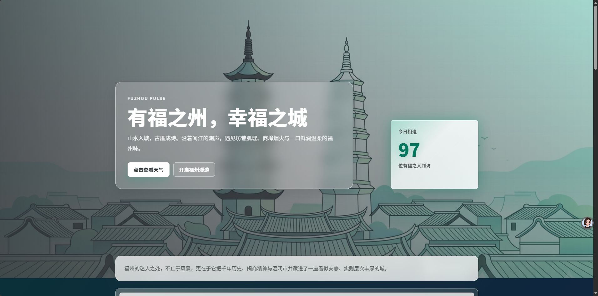
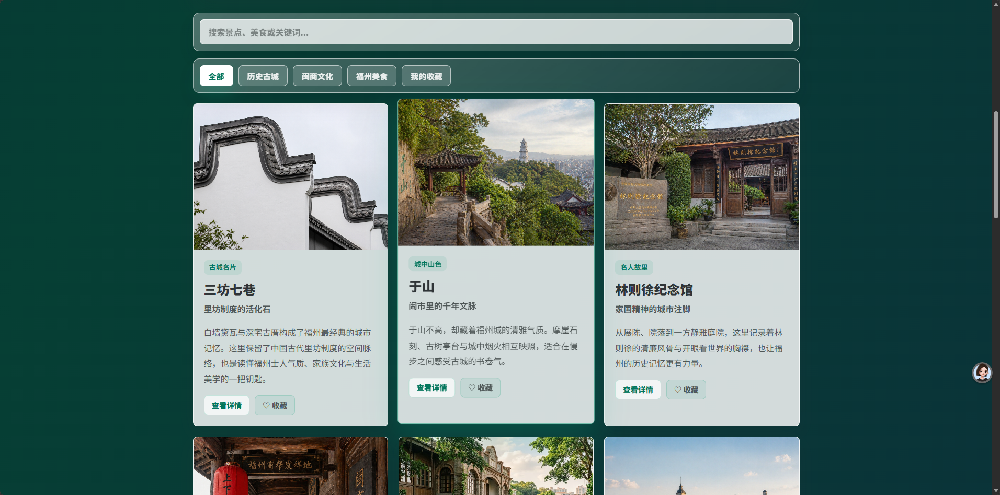
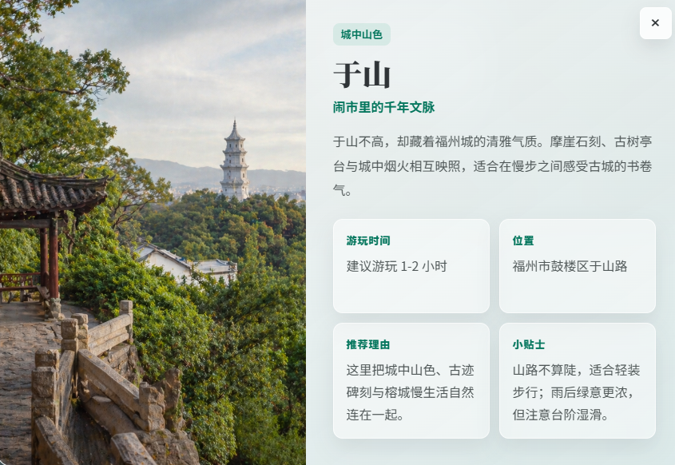
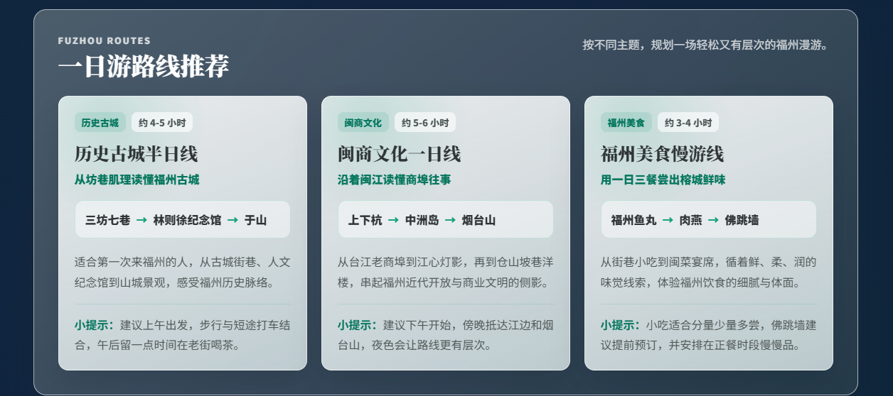
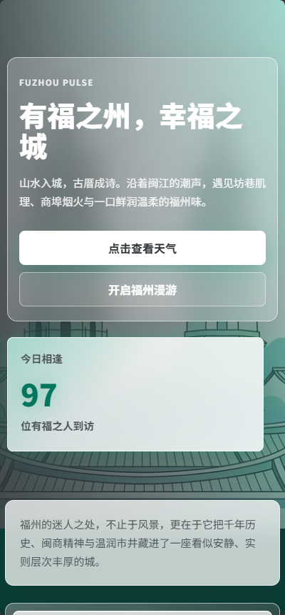

# Fuzhou Pulse | 福州城市文旅推荐平台

## 项目简介

Fuzhou Pulse 是一个以福州城市文旅为主题的学习型全栈练习项目。项目从 V1.0 的静态前端展示页，逐步升级为 V2.0 的前后端版本，展示福州历史街区、城市文化、美食内容、一日游路线推荐、游客留言和 AI 行程推荐等功能。

项目重点不在于商业化复杂系统，而是通过一个完整主题练习前端交互、后端接口、数据组织、AI API 接入、Git 版本管理和线上部署流程。

## 在线预览

- V1.0 静态展示版：<https://jijie616.github.io/fuzhou-pulse/>
- V2.0 前后端 + AI 体验版：<https://fuzhou-pulse-v2.onrender.com>

说明：

- V1.0 基于 GitHub Pages 部署，主要展示静态前端页面。
- V2.0 基于 Render 部署，包含 Node.js 后端、留言接口和 DeepSeek AI 行程推荐。
- Render 免费服务可能存在冷启动，第一次打开 V2.0 链接可能需要等待几十秒。

## 版本说明

- `master`：V1.0 静态稳定版。
- `dev-v2`：V2.0 开发版，包含后端接口、留言、AI 推荐、状态自检等功能。
- `v1.0.0`：V1.0 稳定版本标签。

## 核心功能

- 福州文旅推荐卡片展示，包含历史、文化、美食等内容。
- 分类筛选和关键词搜索。
- 收藏与“我的收藏”，基于 `localStorage` 保存。
- 详情弹窗，展示地点介绍、推荐理由、位置和游玩提示。
- 一日游路线推荐。
- 游客留言与反馈提交。
- AI 行程推荐，支持天数、兴趣、节奏和自由补充需求。
- AI 推荐结果结合项目已有文旅数据，并展示参考地点。
- AI 参考地点可点击打开对应详情。
- Node.js 后端接口提供卡片、路线、留言、AI 和状态自检能力。
- 留言数据使用 JSON 文件进行简单持久化。
- DeepSeek V4 行程推荐接入，未配置密钥或调用失败时可回退到 mock 推荐。

## 技术栈

前端：

- HTML
- CSS
- JavaScript

后端：

- Node.js
- Express
- dotenv
- OpenAI SDK
- DeepSeek API

数据：

- JS 静态数据模块
- JSON 文件持久化

部署：

- GitHub Pages
- Render

## 项目结构

```text
.
├─ web/
│  ├─ index.html
│  ├─ css/
│  ├─ js/
│  └─ assets/
├─ docs/
│  ├─ index.html
│  ├─ css/
│  ├─ js/
│  └─ assets/
├─ backend/
│  ├─ server.js
│  ├─ data/
│  │  ├─ featuredCards.js
│  │  ├─ routePlans.js
│  │  ├─ feedbacks.js
│  │  └─ feedbacks.json
│  ├─ services/
│  │  └─ tripPlannerService.js
│  ├─ package.json
│  ├─ package-lock.json
│  └─ .env.example
├─ PROJECT_NOTE.docx
├─ README.md
└─ .gitignore
```

## 本地运行方式

1. 克隆项目：

```bash
git clone https://github.com/jijie616/fuzhou-pulse.git
cd fuzhou-pulse
```

2. 切换到 V2.0 开发分支：

```bash
git checkout dev-v2
```

3. 进入后端目录：

```bash
cd backend
```

4. 安装依赖：

```bash
npm install
```

5. 配置环境变量：

复制 `backend/.env.example` 为 `backend/.env`，然后按需填写本地配置。

6. 启动后端服务：

```bash
npm run dev
```

7. 打开本地页面：

```text
http://localhost:3000
```

V2.0 推荐直接通过后端访问 `http://localhost:3000`，因为后端会托管 `web/` 目录并提供 `/api` 接口。旧的 `web/` 静态预览方式仍可用于查看前端页面，但 AI、留言等后端功能需要后端服务支持。

## 环境变量说明

`backend/.env` 示例：

```env
PORT=3000
AI_PROVIDER=deepseek
AI_MODEL=deepseek-v4-flash
DEEPSEEK_BASE_URL=https://api.deepseek.com
DEEPSEEK_API_KEY=your_deepseek_api_key_here
```

安全提醒：

- `backend/.env` 不要提交到 Git。
- 真实 API Key 只能放在本地 `backend/.env` 或 Render Environment Variables 中。
- GitHub 仓库中只保留 `backend/.env.example` 作为示例。
- 如果没有配置 DeepSeek API Key，AI 行程推荐会自动回退到 mock 推荐。

## 主要接口说明

- `GET /api/health`：后端健康检查。
- `GET /api/status`：V2.0 线上状态自检，返回服务环境、运行时间、数据数量和 AI 配置状态，不返回真实 API Key。
- `GET /api/featured-cards`：获取福州文旅推荐卡片数据。
- `GET /api/routes`：获取一日游路线推荐数据。
- `GET /api/feedbacks`：获取游客留言列表。
- `POST /api/feedbacks`：提交游客留言，数据保存到 JSON 文件。
- `POST /api/ai/trip-plan`：根据天数、兴趣、节奏和补充需求生成 AI 行程推荐。

## 部署说明

V1.0 静态版部署：

- 使用 GitHub Pages。
- 部署目录为 `docs/`。
- 访问地址：<https://jijie616.github.io/fuzhou-pulse/>

V2.0 Render 部署参考配置：

- Service Type: Web Service
- Branch: `dev-v2`
- Root Directory: `backend`
- Build Command: `npm install`
- Start Command: `npm start`
- Environment Variables:
  - `PORT`
  - `AI_PROVIDER`
  - `AI_MODEL`
  - `DEEPSEEK_BASE_URL`
  - `DEEPSEEK_API_KEY`

## 项目亮点

- 从静态网页逐步升级到前后端项目，保留 V1.0 稳定版本。
- 前端使用结构化数据和 DOM 渲染实现搜索、筛选、收藏和详情弹窗。
- 后端提供统一 API，并托管 V2.0 前端页面。
- 支持 Render 线上部署，并新增 `/api/status` 方便线上巡检。
- AI 推荐结合项目已有文旅数据，减少与项目内容无关的生成结果。
- 留言使用 JSON 文件进行轻量持久化，便于学习接口与文件读写。
- 具备较完整的 Git 分支、标签、提交和部署流程。

## 后续优化方向

- 接入数据库，替代 JSON 文件持久化。
- 增加用户登录和个人收藏同步。
- 增加留言管理和审核功能。
- 继续优化 AI Prompt，让推荐更稳定、更可控。
- 强化移动端交互细节和性能优化。
- 配置独立域名。
- 将后端持久化存储升级为云数据库或对象存储。

## 项目截图

### 首页 Hero 区域



### 推荐卡片与筛选搜索



### 详情弹窗



### 一日游路线推荐



### 移动端适配效果


